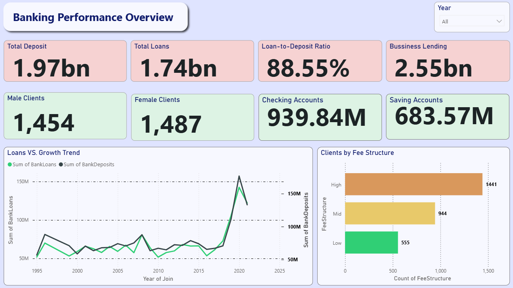
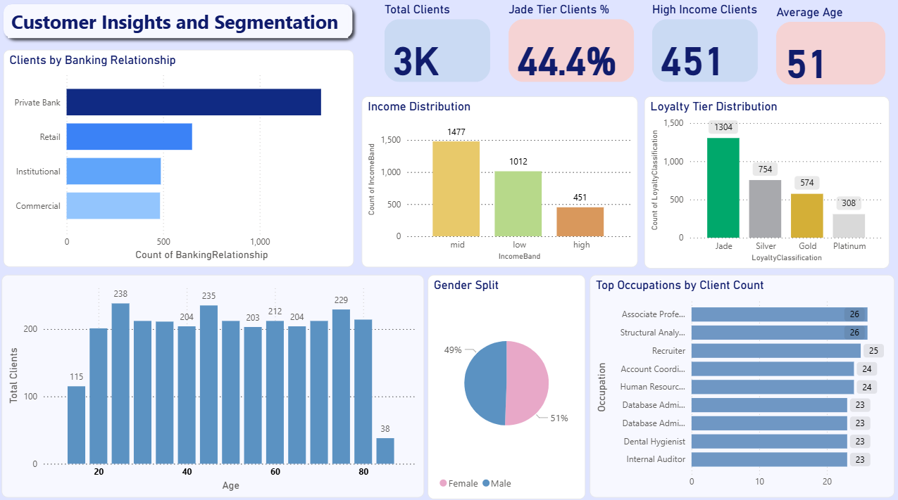
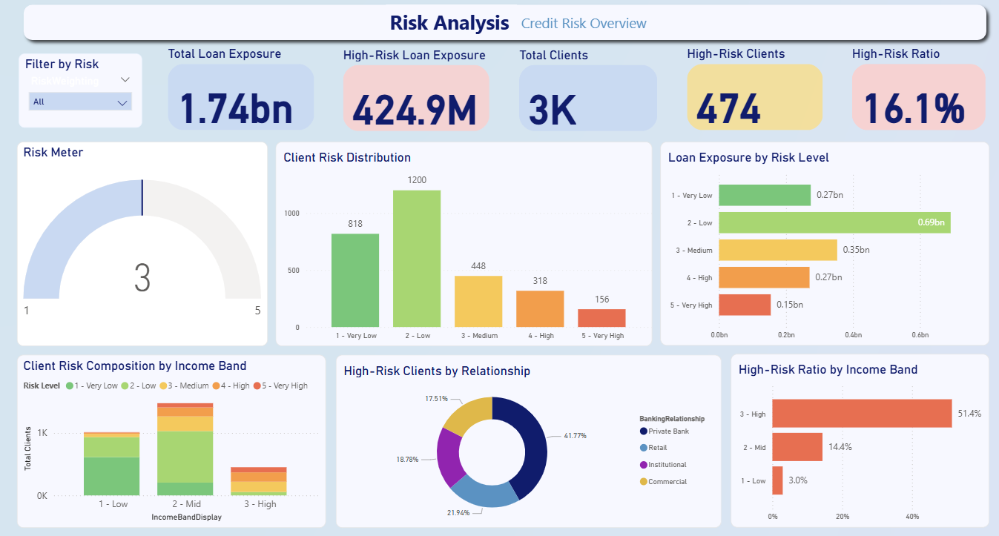
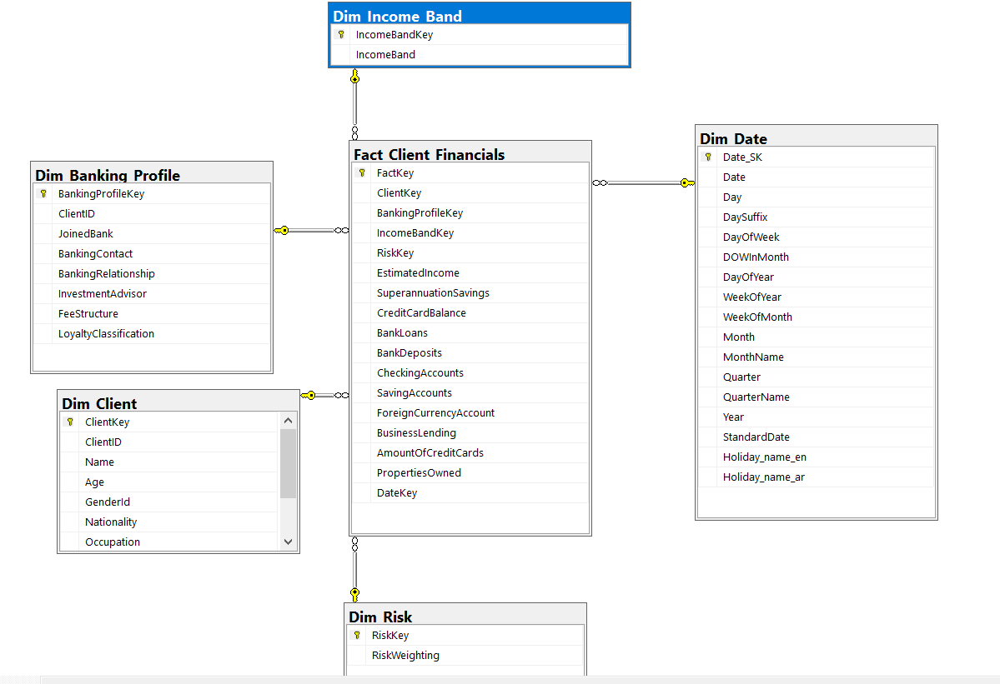
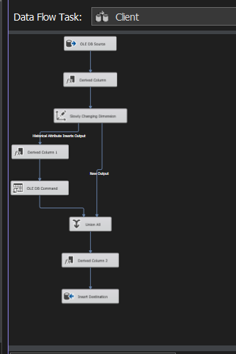

# 🏦 Banking Data Warehouse & Analytics Project

## Overview

End-to-end Banking Data Engineering and Analytics project focused on data cleaning, ETL pipelines, SQL Server Data Warehousing, Star Schema modeling, and interactive Power BI dashboards for financial and risk analysis.

---

# Architecture

```text
Raw Banking Data
        ↓
Python Data Cleaning
        ↓
SQL Server
        ↓
SSIS ETL Pipelines
        ↓
Star Schema Data Warehouse
        ↓
Power BI Dashboards
```

---

# Technology Stack

| Layer | Technologies |
|---|---|
| Data Processing | Python, Pandas |
| Data Warehouse | SQL Server |
| ETL | SSIS |
| Data Modeling | Star Schema |
| Visualization | Power BI |

---

# Data Warehouse Design

### Fact Table
- Fact_Client_Financials

### Dimension Tables
- Dim_Client
- Dim_Income_Band
- Dim_Risk
- Dim_Banking_Profile
- Dim_Date

---

# Power BI Dashboards

## Banking Performance Overview


---

## Customer Insights & Segmentation


---

## Risk Analysis Dashboard


---

# ETL & Data Warehouse Assets

## Banking Star Schema


---

## SSIS Data Flow Pipeline


---

## SSIS Client ETL Pipeline


---

# Repository Structure

```text
Banking-Data-Engineering-Project/
│
├── data/
├── notebooks/
├── powerbi/
├── project_screenshots/
├── README.md
└── LICENSE
```

---

# Contributors

- Reham Mohammed
- Sara Abuzied
